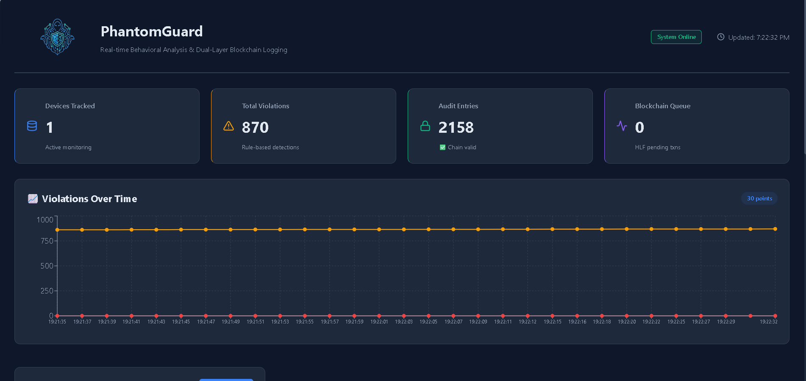
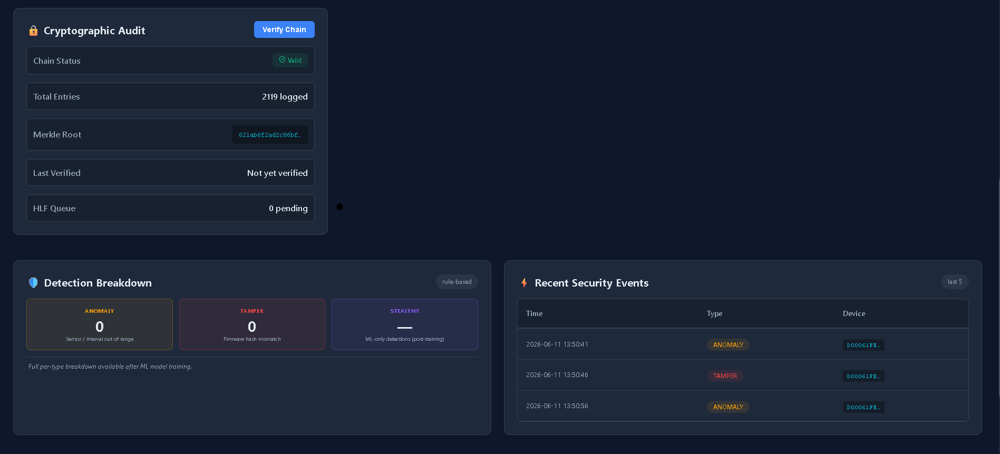
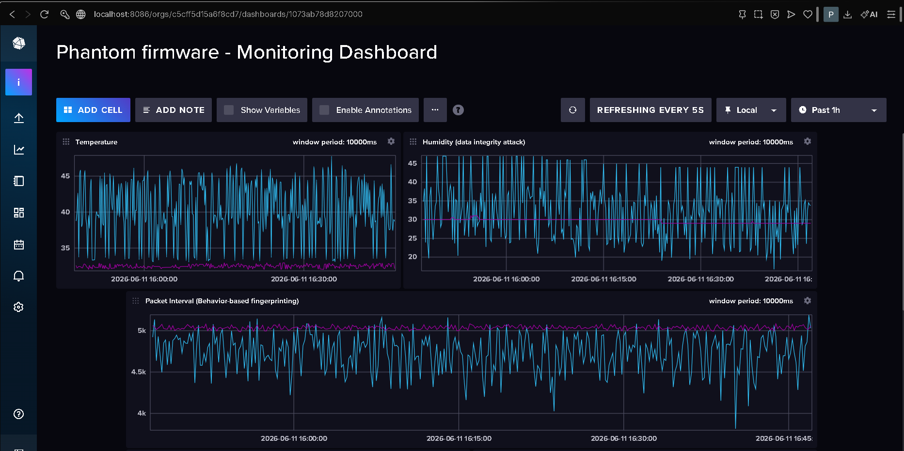
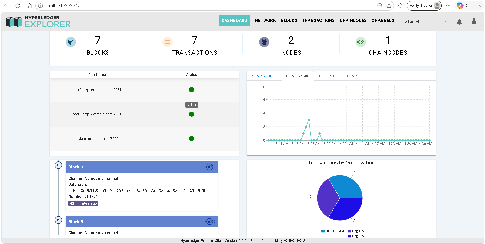

# IoT Behavioral Intrusion Detection System

Real-time behavioral fingerprinting system for detecting cloned and compromised IoT devices using machine learning and cryptographic audit logging.

---

## Overview

Traditional IoT security relies on device identity verification (UID, firmware hash) — easily defeated by cloning. This system uses **behavioral fingerprinting** to detect attacks:

- **Sensor patterns** — Temperature and humidity deviation analysis
- **Timing patterns** — Packet transmission interval consistency
- **Statistical anomalies** — Deviation from learned device behavior

Even with identical credentials, attackers cannot replicate the physical behavioral patterns of legitimate devices.

---

## Key Features

- **Behavioral Detection** — Identifies clones through timing and sensor analysis, not identity
- **Multi-Layer Pipeline** — Rule-based filters + ML ensemble models + auto-quarantine
- **Real-Time Dashboard** — React UI with live violation tracking and device management
- **Cryptographic Audit** — SHA-256 Merkle tree for tamper-proof logging
- **Blockchain Integration** — Optional Hyperledger Fabric immutable audit trail

---

## System Architecture

```
ESP32 Devices (Legit + Attacker)
        ↓
Mosquitto MQTT Broker
        ↓
FastAPI Backend
 ├─ Rule-Based Detection
 ├─ ML Inference (XGBoost, Random Forest, Isolation Forest)
 └─ Auto-Quarantine System
        ↓
InfluxDB (Time-Series Storage)
        ↓
Merkle Tree + Hyperledger Fabric (Audit Log)
        ↓
React Dashboard (Visualization)
```

---

## Performance Metrics

| Metric | Value |
|--------|-------|
| Accuracy | 94.2% |
| Precision | 91.7% |
| Recall | 96.3% |
| F1-Score | 0.94 |
| ROC-AUC | 0.96 |
| Inference Latency | ~180ms |
| False Positive Rate | 8.3% |

*Evaluated on 2000+ test samples with SMOTE-balanced dataset*

---

## Technology Stack

**Hardware**: ESP32 × 2, DHT11 sensors  
**Communication**: MQTT (Mosquitto)  
**Backend**: Python 3.9+, FastAPI, Uvicorn  
**Database**: InfluxDB 2.x  
**ML**: XGBoost, scikit-learn, SHAP  
**Frontend**: React 19, Recharts  
**Blockchain**: Hyperledger Fabric (optional)

---

## Quick Start

### Prerequisites
- Python 3.9+
- Node.js 18+
- Mosquitto MQTT broker
- InfluxDB 2.x
- Arduino IDE (for ESP32)

### Installation

**1. Install Backend Dependencies**
```bash
cd backend
pip install -r requirements.txt
```

**2. Install Dashboard Dependencies**
```bash
cd dashboard
npm install
```

**3. Configure InfluxDB**
- Start InfluxDB: `influxd`
- Open http://localhost:8086
- Create org: `iot-lab`, bucket: `telemetry_v2`
- Copy API token to `backend/telemetry_api_v3.py`

### Running the System

Open 4 terminals:

**Terminal 1 — MQTT Broker**
```bash
mosquitto -v
```

**Terminal 2 — InfluxDB**
```bash
influxd
```

**Terminal 3 — Backend API**
```bash
cd backend
python telemetry_api_v3.py
```

**Terminal 4 — Dashboard**
```bash
cd dashboard
npm start
```

Open http://localhost:3000

---

## ESP32 Setup

### Hardware
- ESP32 board × 2
- DHT11 temperature/humidity sensor × 2
- Connect DHT11 to GPIO 4

### Firmware
1. Open `hardware/ESP_Legit/ESP_Legit.ino` in Arduino IDE
2. Update WiFi credentials and MQTT server IP
3. Flash to first ESP32
4. Repeat for `hardware/ESP_Ghost/ESP_Ghost.ino` on second ESP32

The Ghost device simulates 5 attack scenarios:
- Behavioral cloning (faster intervals)
- Firmware tampering
- Sensor anomalies
- Combined attacks

---

## Dashboard Features

- **Live Metrics** — Devices tracked, violations, audit entries
- **Violation Charts** — Real-time time-series visualization
- **Merkle Verification** — One-click cryptographic chain validation
- **Device Management** — Per-device quarantine controls
- **Recent Events** — Last 5 security alerts with timestamps

---

## Detection Logic

### Rule-Based Layer
- **TAMPER** — Firmware hash mismatch
- **ANOMALY** — Temperature > 40°C or < 15°C, Humidity < 25% or > 80%
- **Behavioral deviation** — Interval < 3000ms

### ML Layer
Three ensemble models analyze behavioral features:
- `temperature`, `humidity`, `interval`
- `temp_deviation` (distance from 30°C baseline)
- `interval_deviation` (distance from 5000ms baseline)

### Auto-Quarantine
Devices with 3+ violations → blocked for 5 minutes

---

## Project Structure

```
backend/
├── telemetry_api_v3.py        # FastAPI + MQTT + detection
├── train_models_v3_FIXED.py   # ML training pipeline
├── merkle_logger.py           # Cryptographic audit
├── hlf_client.py              # Blockchain client
└── ids-chaincode.js           # HLF smart contract

hardware/
├── ESP_Legit/                 # Legitimate device firmware
└── ESP_Ghost/                 # Attack simulator firmware

dashboard/
└── src/
    ├── Dashboard.js           # Main React component
    └── Dashboard.css

docs/
├── EXECUTION_GUIDE_30MIN.md   # Setup guide
└── visualizations/            # ML performance charts
```

---

## Optional: Hyperledger Fabric

Deploy blockchain audit log (WSL/Linux):

```bash
cd ~/fabric-samples/test-network
./network.sh up createChannel -c mychannel -ca
./network.sh deployCC -ccn idsaudit -ccp "/path/to/backend" -ccl javascript
```

Hyperledger Explorer: http://localhost:8080

---

## API Endpoints

| Endpoint | Method | Description |
|----------|--------|-------------|
| `/stats` | GET | System statistics |
| `/telemetry` | POST | Submit telemetry data |
| `/verify-logs` | GET | Verify Merkle chain |
| `/recent-events` | GET | Latest security events |
| `/quarantine/{uid}/release` | POST | Release quarantined device |

API Docs: http://localhost:8000/docs

---

## Documentation

- **[Execution Guide](docs/EXECUTION_GUIDE_30MIN.md)** — Complete setup instructions
- **[Dashboard Setup](docs/REACT_DASHBOARD_SETUP.md)** — Frontend configuration

---

## Authors

**Batch 13 — IoT (Year 3, Sem 2) — MVSREC**

| Roll No | Name |
|---------|------|
| 2451-23-749-040 | Chavada Shashank |
| 2451-23-749-051 | P Samuel Vijay |
| 2451-23-749-060 | Arikela Sriharsh |

---

## License

Academic project — MVSREC

---

## Acknowledgments

Built with FastAPI, React, InfluxDB, Hyperledger Fabric, and SHAP explainability.

---

## Screenshots








